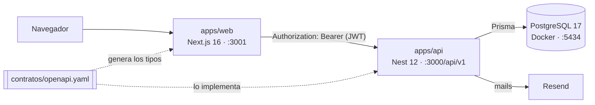

# Deploy Club — Sistema de Reservas

MVP de una plataforma de reservas para **Deploy**, un club deportivo con canchas de Tenis, Pádel y Fútbol 5. Los socios consultan la disponibilidad, reservan turnos con equipamiento opcional y cancelan; el club administra canchas, equipamiento y reservas desde un panel.

Es el trabajo práctico grupal de *OpenSpec & CI/CD*, con enfoque **API-First**: el contrato de la API y las specs de OpenSpec se escriben antes que el código.

> **Estado:** la base está lista: contrato OpenAPI 2.2.0, specs de OpenSpec, base de datos con migraciones y seed, y CI. Las funcionalidades (autenticación, disponibilidad, reservas, notificaciones, administración y sitio institucional) se implementan cada una en su rama. Mientras tanto, la API responde el "Hello World" de Nest y el front muestra la página inicial de Next. El avance al día está en [`docs/memoria-proyecto.md`](docs/memoria-proyecto.md).

## Arquitectura

Monorepo con npm workspaces: dos aplicaciones que respetan un mismo contrato.



| Pieza | Tecnología | Qué hace |
|---|---|---|
| `contratos/openapi.yaml` | OpenAPI 3.0.3 | Contrato de la API y fuente de verdad: endpoints, esquemas y errores |
| `openspec/` | OpenSpec | Comportamiento del sistema en 7 capacidades: autenticación, catálogo, disponibilidad, reservas, notificaciones, institucional y administración |
| `apps/api` | Nest 12, Prisma 6, TypeScript 6, Jest 30 | La API: reglas de negocio, autenticación y acceso a datos |
| `apps/web` | Next.js 16 (App Router), React 19, Tailwind 4 | El sitio institucional, las pantallas de reserva y el panel del club |
| Base de datos | PostgreSQL 17 en Docker | Persistencia; también garantiza que un turno no se reserve dos veces |

Las decisiones que definen el sistema:

- **El contrato manda.** `openapi.yaml` vive fuera de `apps/` porque no es del backend: lo respetan las dos aplicaciones. Nest lo implementa y el front genera sus tipos desde él, así que un endpoint que se desvía del contrato rompe el build del front.
- **La autenticación vive en Nest.** La API emite y valida el JWT. El front lo guarda en una cookie `httpOnly` y lo reenvía en cada llamada, así cada endpoint se defiende solo y el contrato también describe la seguridad.
- **La regla más importante la garantiza la base.** Una cancha no se puede reservar dos veces en el mismo turno (RN-01): lo asegura un índice único parcial en PostgreSQL, no solo el código.
- **Un solo formato de error**, el `Error` del contrato, que un filtro global de Nest aplica a todas las respuestas.

```text
apps/api/             Nest: módulos por dominio, prisma/ (schema, migraciones, seed) y test/ (e2e)
apps/web/             Next.js
contratos/            openapi.yaml
openspec/             specs y cambios de OpenSpec
docs/                 requisitos, arquitectura, identidad, memoria del proyecto y prototipo de diseño
.github/workflows/    ci.yml
docker-compose.yml    PostgreSQL 17 local
```

Para profundizar:

- [`docs/arquitectura.md`](docs/arquitectura.md): flujo de autenticación, cliente tipado, manejo de errores, variables de entorno y CI.
- [`docs/requisitos.md`](docs/requisitos.md): alcance, roles, reglas de negocio, requisitos funcionales y modelo de datos.
- [`contratos/openapi.yaml`](contratos/openapi.yaml): el contrato de la API.
- [`openspec/`](openspec/): las specs de OpenSpec.
- [`docs/estado-del-proyecto.md`](docs/estado-del-proyecto.md): en qué está el trabajo hoy, qué falta y quién lo destraba.
- [`docs/memoria-proyecto.md`](docs/memoria-proyecto.md): decisiones vigentes, convenciones e historial.

## Requisitos previos

- **Node 24.21**, la versión de [`.nvmrc`](.nvmrc). Con nvm: `nvm install 24.21.0` y `nvm use 24.21.0`. Con Node 20 los tests de la API no corren.
- **Docker Desktop**, abierto mientras trabajás: la base corre en un contenedor.
- **Git**.

## Cómo levantarlo

Clonar e instalar las dependencias:

```bash
git clone https://github.com/rociobazan/club-deportivo-deploy.git
cd club-deportivo-deploy
npm install
```

Crear las variables de entorno de la API. `DATABASE_URL` ya viene completa y apunta al contenedor; las demás claves se completan cuando las necesita cada funcionalidad.

```bash
cp apps/api/.env.example apps/api/.env
cp apps/web/.env.example apps/web/.env.local
```

El front solo necesita `API_URL`, que apunta a la API local.

Levantar la base y cargarle los datos:

```bash
npm run db:up        # PostgreSQL 17 en el puerto 5434
npm run db:migrate   # aplica las migraciones
npm run db:seed      # disciplinas, canchas, equipamiento y usuarios de prueba
```

Correr cada aplicación en su propia terminal:

```bash
npm run dev:api      # API en http://localhost:3000
npm run dev:web      # front en http://localhost:3001
```

Los puertos 3000, 3001 y 5434 tienen que estar libres: si otra aplicación usa el 3000, la API no arranca (`EADDRINUSE`).

**La API no arranca sin `JWT_SECRET` y `JWT_EXPIRES_IN`** en `apps/api/.env`: en desarrollo sirve cualquier texto largo como secreto y `1h` como vigencia. Si falta alguna, el arranque corta diciendo cuál.

### Usuarios de prueba

Los carga el seed, solo para desarrollo local.

| Rol | Mail | Clave |
|---|---|---|
| Administrador | `admin@club.test` | `clave1234` |
| Socio | `socio@club.test` | `clave1234` |

Para probar el ingreso desde el sitio: <http://localhost:3001/ingresar> con cualquiera de los dos. En <http://localhost:3001/registro> se crea un socio nuevo. El catálogo está en <http://localhost:3001/canchas> y los turnos libres en <http://localhost:3001/disponibilidad>. Los tests e2e crean datos propios (`e2e …`, usuarios `@e2e.test`) y borran solo esos.

**Horario y zona del club.** `HORA_APERTURA` (`08:00`), `HORA_CIERRE` (`23:00`) y `ZONA_HORARIA_CLUB` (`America/Argentina/Cordoba`) tienen valor por defecto, así que no hace falta definirlas. Si las cambiás, van **en los dos** `.env`: la API calcula la grilla con ellas y el sitio la dibuja.

### Comandos útiles

| Comando | Qué hace |
|---|---|
| `npm run test:api` | Tests unitarios de la API |
| `npm run test:e2e --workspace api` | Tests e2e de la API |
| `npm run spec:validate` | Valida las specs de OpenSpec en modo estricto |
| `npm run contrato:lint` | Valida el contrato OpenAPI |
| `npm run spec:view` | Muestra las specs y los cambios de OpenSpec |
| `npm run db:studio` | Abre Prisma Studio para explorar la base |
| `npm run db:down` | Apaga el contenedor; los datos quedan en el volumen |

## Flujo de trabajo con OpenSpec

Cada funcionalidad empieza por su especificación:

1. **Proponer** con el asistente de IA (`/opsx:propose`): se crea `openspec/changes/<cambio>/` con la propuesta, las specs, el diseño y las tareas.
2. **Revisar** la propuesta entre los cuatro antes de escribir código.
3. **Implementar** las tareas (`/opsx:apply`) en la rama del cambio.
4. **Archivar** después del merge, en un PR propio: `openspec archive <cambio>` pasa las specs a `openspec/specs/`. Se archiva de a un cambio por vez, avisando al grupo.

`npm run spec:validate` tiene que pasar en cada paso; el CI lo verifica en cada PR.

## Flujo de trabajo con Git

- **Nada entra a `main` sin PR**, y cada PR necesita al menos una aprobación de un compañero y el CI en verde.
- **Una rama por spec o funcionalidad**: `feature/spec-<nombre>`, `fix/<nombre>`, `chore/<nombre>` o `docs/<nombre>`.
- **Commits convencionales en castellano** (`feat(reservas): ...`), cada uno desde la cuenta de su autor.
- **Sin atribución a asistentes de IA** en commits, PRs ni issues (ver [`AGENTS.md`](AGENTS.md)).

## Integración continua

[`.github/workflows/ci.yml`](.github/workflows/ci.yml) corre en cada PR hacia `main` y en cada push a `main`:

| Check | Qué valida |
|---|---|
| `specs` | Las specs de OpenSpec (`openspec validate --all --strict`) y el contrato OpenAPI |
| `api` | Aplica las migraciones sobre un PostgreSQL 17 vacío y corre lint, build, tests unitarios y e2e de la API |
| `web` | Lint y build del front; el build corre TypeScript, así que también verifica los tipos |

La protección de `main` exige los tres checks en verde y una aprobación antes de mergear, sin excepciones para los administradores. El detalle está en [`docs/arquitectura.md`](docs/arquitectura.md), secciones 6 y 7.

## Equipo

| Integrante | GitHub |
|---|---|
| Jeremías Fernández | [@Jere3200](https://github.com/Jere3200) |
| Adrián Ramírez | [@AdrianRamirezok](https://github.com/AdrianRamirezok) |
| Rocío Bazán | [@rociobazan](https://github.com/rociobazan) |
| Renzo Bazán | — |

El reparto de las funcionalidades está en [`docs/memoria-proyecto.md`](docs/memoria-proyecto.md).
